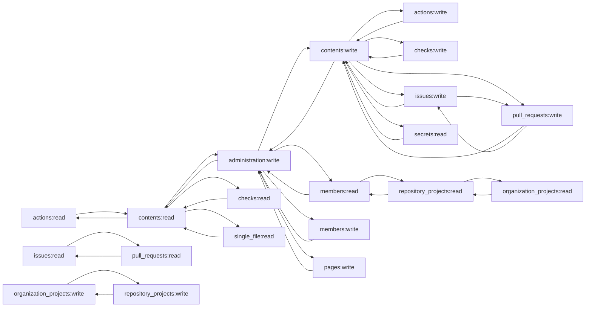

# Permission dependency graph (Type A overlaps merged)

Generated by `cmd/build`. Arrows mean "requires" (technical prerequisite).

```mermaid
flowchart LR
  actions_read["actions:read"]
  actions_write["actions:write"]
  administration_write["administration:write"]
  checks_read["checks:read"]
  checks_write["checks:write"]
  contents_read["contents:read"]
  contents_write["contents:write"]
  issues_read["issues:read"]
  issues_write["issues:write"]
  members_read["members:read"]
  members_write["members:write"]
  organization_projects_read["organization_projects:read"]
  organization_projects_write["organization_projects:write"]
  pages_write["pages:write"]
  pull_requests_read["pull_requests:read"]
  pull_requests_write["pull_requests:write"]
  repository_projects_read["repository_projects:read"]
  repository_projects_write["repository_projects:write"]
  secrets_read["secrets:read"]
  single_file_read["single_file:read"]
  actions_read --> contents_read
  actions_write --> contents_write
  administration_write --> contents_read
  administration_write --> contents_write
  administration_write --> members_read
  administration_write --> members_write
  administration_write --> pages_write
  checks_read --> contents_read
  checks_write --> contents_write
  contents_read --> actions_read
  contents_read --> administration_write
  contents_read --> checks_read
  contents_read --> single_file_read
  contents_write --> actions_write
  contents_write --> administration_write
  contents_write --> checks_write
  contents_write --> issues_write
  contents_write --> pull_requests_write
  contents_write --> secrets_read
  issues_read --> pull_requests_read
  issues_write --> contents_write
  issues_write --> pull_requests_write
  members_read --> administration_write
  members_read --> repository_projects_read
  members_write --> administration_write
  organization_projects_read --> repository_projects_read
  organization_projects_write --> repository_projects_write
  pages_write --> administration_write
  pull_requests_read --> issues_read
  pull_requests_write --> contents_write
  pull_requests_write --> issues_write
  repository_projects_read --> members_read
  repository_projects_read --> organization_projects_read
  repository_projects_write --> organization_projects_write
  secrets_read --> contents_write
  single_file_read --> contents_read
```
